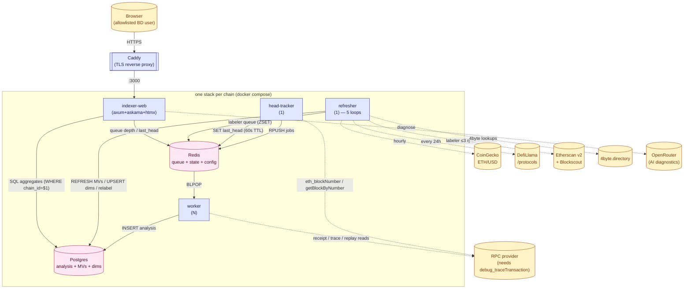
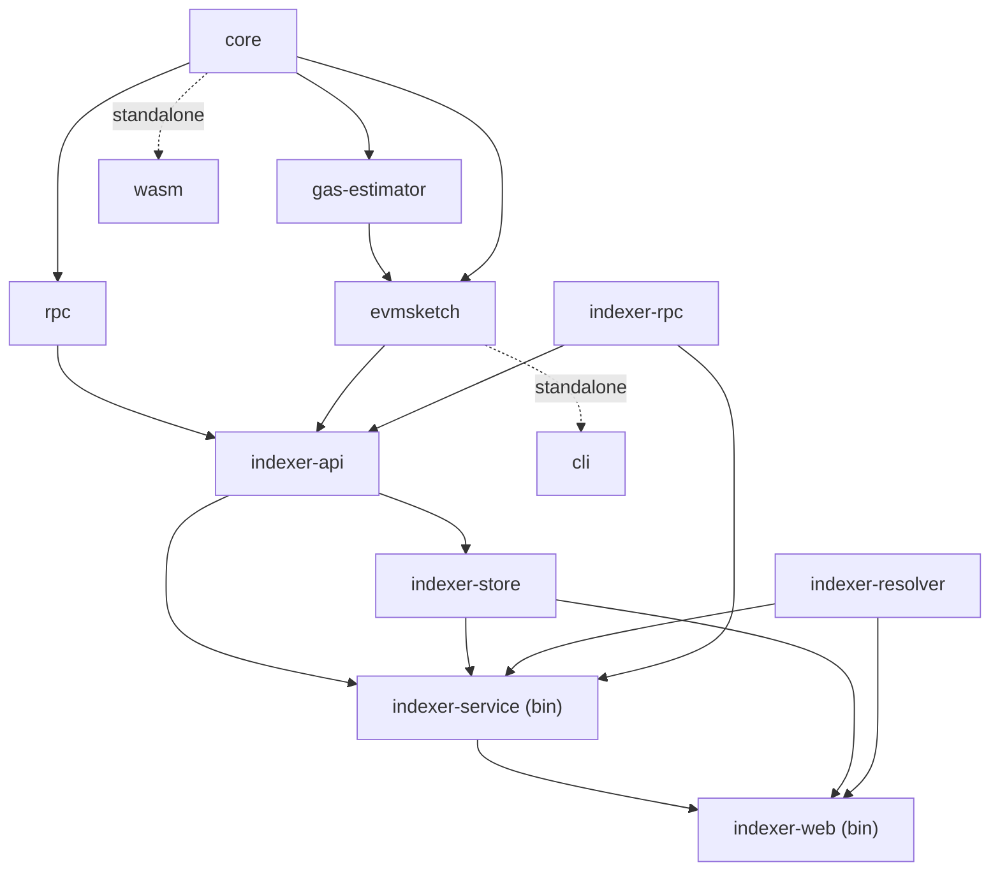
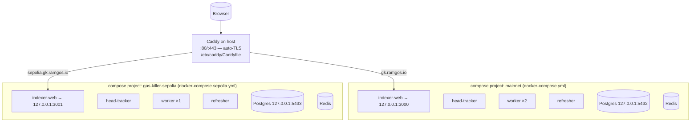
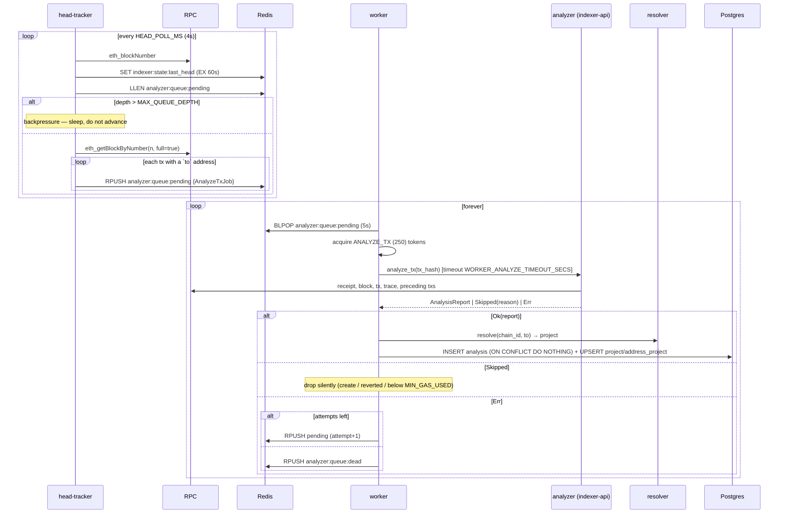
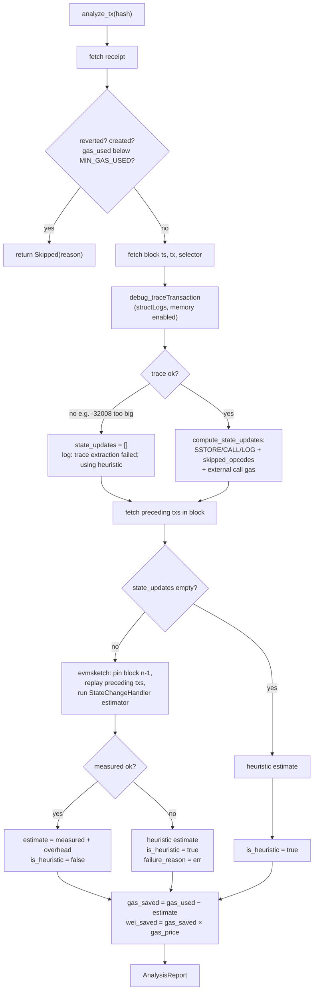
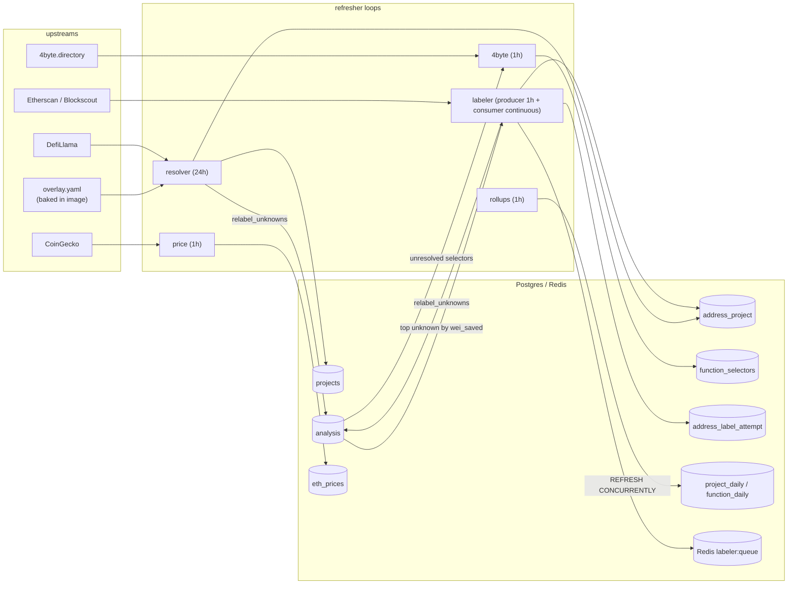
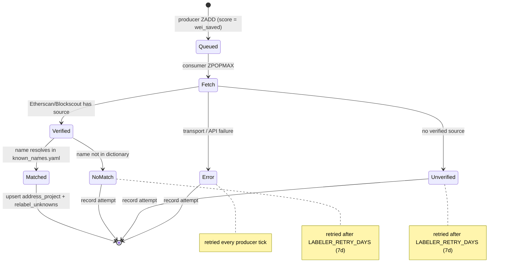
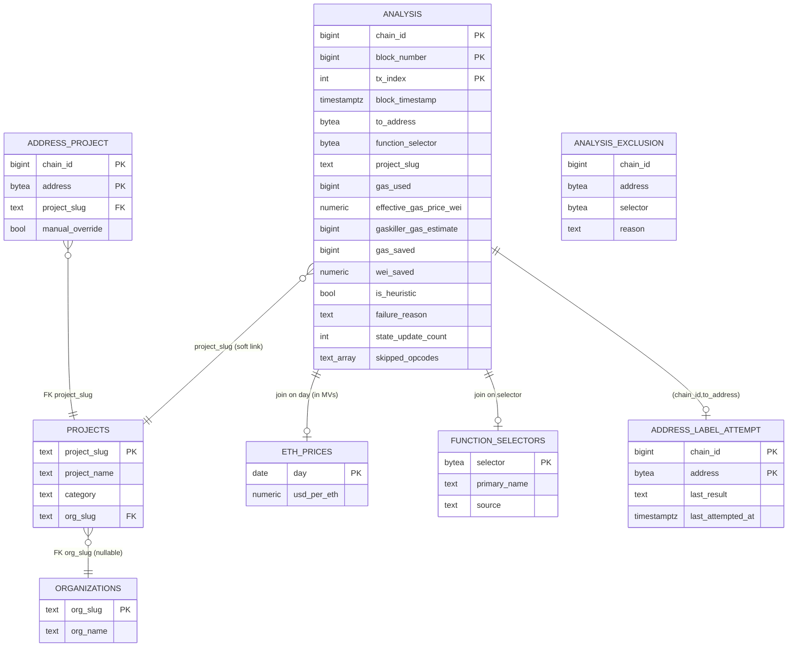
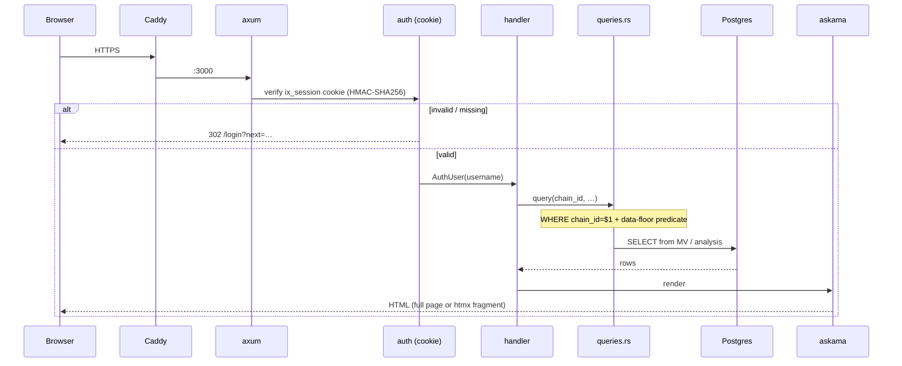

# Gas-Killer Indexer — System Architecture

> **Written:** 2026-06-17 · **Against commit:** `952015d` — _fix(deploy): bind mainnet postgres to loopback_
>
> This doc describes the system as of the commit above. If you're reading it much later, treat it as a starting map and trust the code where they disagree.

**Audience:** engineers who need to understand the system and debug it in production.

This document explains *how the whole thing fits together* and *where to look when something breaks*. It complements two existing docs:

- [`INDEXER.md`](./INDEXER.md) — original design rationale, deployment runbook, and the **Sepolia second-chain** instructions.
- [`../indexer-arch.mmd`](../indexer-arch.mmd) — the original one-shot architecture diagram.

> **How to read this doc.** Start with [§1 Mental model](#1-mental-model) and [§2 Component map](#2-component-map). If you're chasing a specific bug, jump straight to [§12 Debugging playbook](#12-debugging-playbook), which maps symptoms → causes → where to look, and back-references the relevant flow sections. Code is cited as `crate/path › symbol` rather than line numbers (which drift); grep the symbol.

---

## Table of contents

1. [Mental model](#1-mental-model)
2. [Component map (crates)](#2-component-map-crates)
3. [Deployment topology](#3-deployment-topology)
4. [Flow A — Ingestion pipeline](#4-flow-a--ingestion-pipeline)
5. [Flow B — The analysis engine](#5-flow-b--the-analysis-engine-core-ip)
6. [Flow C — The refresher](#6-flow-c--the-refresher)
7. [The auto-labeler state machine](#7-the-auto-labeler-state-machine)
8. [Storage & schema](#8-storage--schema)
9. [The web application](#9-the-web-application)
10. [Cross-cutting — rate limiting & retry](#10-cross-cutting--rate-limiting--retry)
11. [Configuration reference](#11-configuration-reference)
12. [Debugging playbook](#12-debugging-playbook)
13. [Known limitations & correctness caveats](#13-known-limitations--correctness-caveats)

---

## 1. Mental model

**What it does.** The gas-killer indexer watches an EVM chain, and for every "interesting" transaction it asks: *if this transaction's net state changes had been applied by a lean purpose-built executor contract instead of running the full business logic, how much gas would it have saved?* It groups those savings by project / contract / function and surfaces them through a business-development (BD) dashboard.

**The savings model.** For one transaction:

```
gas_saved  = gas_used − gaskiller_gas_estimate
wei_saved  = gas_saved × effective_gas_price_wei
usd_saved  = wei_saved / 1e18 × (ETH/USD on that day)   ← computed in the rollup MVs
```

`gaskiller_gas_estimate` is produced two ways (see [§5](#5-flow-b--the-analysis-engine-core-ip)):
- **Measured** (preferred): replay the transaction's extracted state changes through a real EVM (`evmsketch` + `gas-estimator`) and measure gas. `is_heuristic = false`.
- **Heuristic** (fallback): a static cost formula when the trace can't be fetched or the measured run fails. `is_heuristic = true`. **The heuristic systematically overshoots savings — treat heuristic rows as low-confidence** (see [§13](#13-known-limitations--correctness-caveats)).

**One deployment = one chain.** Every row is stamped with `chain_id`. A single service process indexes one chain (`CHAIN_ID` + `RPC_URL`); the schema is chain-partitioned end to end so multiple chains can share a database, but in practice we run a **separate stack per chain** (mainnet + Sepolia).

### System context



*Solid = data writes; dotted = outbound RPC/HTTP.*

---

## 2. Component map (crates)

Rust workspace. The original gas-analyzer crates (`core`, `gas-estimator`, `rpc`, `evmsketch`, `anvil`, `cli`, `wasm`) are the analysis library; the six `indexer-*` crates wrap them into a service.

| Crate | Role | Deployed? |
|---|---|---|
| `core` | Trace parsing, state-update extraction, opcode detection, ABI encoding. | lib |
| `gas-estimator` | revm-based gas measurement, DB-agnostic (works on RPC-backed or empty state). | lib |
| `rpc` (`gas-analyzer-rpc`) | alloy helpers: fetch trace, compute state updates from a tx, fetch preceding txs. | lib |
| `evmsketch` | The measured-estimation backend: pins block state, replays, runs the estimator contract. **Mainnet-spec only.** | lib |
| `anvil` | Legacy local-fork backend (CLI only). | lib |
| `indexer-rpc` | Global token-bucket **rate limiter** + bounded concurrency + retry helpers + per-method weights. | lib |
| `indexer-api` | Thin orchestration layer: `analyze_tx(hash) → AnalysisReport`. **The only code that touches gas-analyzer internals.** | lib |
| `indexer-store` | Postgres schema (sqlx migrations) + `Store` API + the materialized views. | lib |
| `indexer-resolver` | address → project mapping (overlay YAML + DefiLlama + Etherscan), held behind `ArcSwap`. | lib |
| **`indexer-service`** | One binary, three subcommands: **`head-tracker`**, **`worker`**, **`refresher`**. | **bin** |
| **`indexer-web`** | The dashboard + admin UI (axum + askama + htmx). | **bin** |
| `cli` | One-shot "analyze a tx" dev tool. **Not** part of the service. | standalone |
| `wasm` | Browser-side estimator. **Not** part of the service. Runs on empty state → its savings figures are *not* trustworthy (see [§13](#13-known-limitations--correctness-caveats)). | standalone |



Both binaries are baked into **one Docker image** (`gas-killer/indexer-service:local`); each compose service just picks the binary + subcommand via its `command:`. The image also bakes in `overlay.yaml`, `known_names.yaml`, and the web `static/` + `templates/` (askama compiles templates **into** the binary — template changes require an image rebuild).

---

## 3. Deployment topology

Runs on a single host (Hetzner). Ingress is **Caddy** (not nginx) on the host, terminating TLS with automatic Let's Encrypt and reverse-proxying to each dashboard. Each chain is an **isolated docker compose project**.



Key facts (verified in prod):
- **Mainnet** `gk.ramgos.io` → `127.0.0.1:3000`, `CHAIN_ID=1`. **Sepolia** `sepolia.gk.ramgos.io` → `127.0.0.1:3001`, `CHAIN_ID=11155111`.
- Both Postgres instances bind **loopback only** (`127.0.0.1:5432` / `:5433`) — never expose the DB publicly.
- The two stacks share nothing: separate Postgres, Redis, networks, volumes (`gas-killer-sepolia_*`).
- **Deploy flow:** commit on laptop → `git push` → `ssh hetzner` → `git pull --ff-only` → rebuild image with `docker compose build indexer-build` *(only if Rust or a template changed)* → `docker compose [-f docker-compose.sepolia.yml] up -d <svc>`. Schema auto-migrates on worker/refresher boot.
- USD on Sepolia is priced at the **mainnet** ETH rate (CoinGecko fetches `ethereum` regardless of chain); DefiLlama is disabled there (mainnet-only list).

---

## 4. Flow A — Ingestion pipeline

`head-tracker` discovers transactions and fans them out as jobs; `worker`s consume jobs, analyze, and persist. Redis is the buffer between them.



**Redis keys** (`indexer-service/src/queue.rs`, `indexer-service/src/lib.rs`):

| Key | Type | Purpose |
|---|---|---|
| `analyzer:queue:pending` | list | Jobs awaiting analysis. `RPUSH` to enqueue, `BLPOP` to claim, `LLEN` for depth. |
| `analyzer:queue:dead` | list | Jobs that exhausted retries (job + `failed_at` + reason). |
| `indexer:state:last_head` | string (60s TTL) | Latest head the tracker saw; the health view reads it to compute "blocks behind". |
| `labeler:queue` | sorted set | Auto-labeler work queue, scored by `wei_saved` (see [§7](#7-the-auto-labeler-state-machine)). |

**Job payload** (`AnalyzeTxJob`): `{ chain_id, tx_hash, block_number, tx_index, attempt }`.

**Important properties / gotchas:**
- **Live-only.** Starts at the current head and only moves forward — *no historical backfill*. A fresh deployment's dashboard is empty until new blocks accrue.
- **Backpressure, not dropping.** When `pending > MAX_QUEUE_DEPTH` (default 1000) the head-tracker logs `queue saturated, sleeping` and waits. It never drops blocks; it lags. A high steady-state depth means workers can't keep up (too few workers, RPC throttling, or slow traces).
- **No visibility timeout.** A worker that crashes mid-job loses that job (claimed via `BLPOP`, not tracked in-flight). Accepted because reorgs are ignored anyway.
- **Reorgs ignored** — ~1% of head rows may be from reorged blocks.
- **Skips happen twice:** the head-tracker skips contract-creation txs; the analyzer skips create/reverted/below-`MIN_GAS_USED`.

**Key log strings:** `head-tracker starting`, `block fanned out` (with `enqueued=`), `queue saturated, sleeping` (with `depth=`), `worker ready`, `trace extraction failed; using heuristic`. *Successful per-tx persistence logs at DEBUG (`persisted`), so at `RUST_LOG=info` a healthy worker is quiet between warnings.*

---

## 5. Flow B — The analysis engine (core IP)

`indexer-api › analyze_tx(tx_hash)` turns a hash into an `AnalysisReport`. This is where every `analysis` column comes from.



**How each `analysis` column is produced:**

| Column | Source |
|---|---|
| `gas_used`, `effective_gas_price_wei` | tx receipt |
| `from_address`, `to_address`, `function_selector` | tx / receipt |
| `state_update_count` | count of extracted SSTORE/CALL/LOG state updates |
| `skipped_opcodes` | `{CREATE, CREATE2, SELFDESTRUCT, TSTORE}` seen at top-level scope during trace parsing (`core/trace.rs`) |
| `gaskiller_gas_estimate` | (measured **or** heuristic) **+ a fixed overhead constant** |
| `is_heuristic` | `false` if the measured EVM run succeeded; `true` if it fell back |
| `failure_reason` | first line of the error when the measured run failed (else NULL) |
| `gas_saved` / `wei_saved` | the savings math above (`saturating_sub`) |

**Trace path vs. heuristic fallback — the most important debugging distinction.** The measured path needs the structLog trace (`debug_traceTransaction`, with memory enabled so LOG data can be read). It falls back to the heuristic when **either**:
1. **Trace fetch fails.** The big real-world one: providers cap response size, and structLog traces of heavy txs blow past it — e.g. `error code -32008: Response is too big, "Exceeded max limit of 167772160"` (160 MiB). The log line is `trace extraction failed; using heuristic`.
2. **The measured run fails** after a good trace (estimator contract reverts, preceding-tx replay corrupts state, etc.) → `is_heuristic = true`, `failure_reason = Some(...)`.

A high `heuristic_rate` (surfaced on `/admin` and per-row in the MVs) therefore means the savings numbers are *soft*. See [§13](#13-known-limitations--correctness-caveats).

**`skipped_opcodes`** marks txs the model can't price (CREATE/CREATE2/SELFDESTRUCT/TSTORE). These rows are written but **suppressed from the dashboard** (the MVs filter `cardinality(skipped_opcodes)=0`). The column shipped 2026-05-25; rows analyzed before then default to `'{}'` (unflagged) — which is the reason the dashboard has an admin-settable **data floor** (see [§9](#9-the-web-application)).

**EVM spec.** `evmsketch` derives the EVM spec by applying the **mainnet** hardfork schedule to the block header (`EthSpec::mainnet()`). Per-opcode gas costs are identical across mainnet and Sepolia at the current fork, so estimates are valid in steady state — re-validate only around network-upgrade windows where Sepolia forks ahead of mainnet.

---

## 6. Flow C — The refresher

One process running **five independent best-effort loops**. Each runs once at startup (so nothing is stale), then on its own cadence. A failure in one loop is logged and never crashes the others.



| Loop | Cadence (env) | Reads | Writes | Disable by |
|---|---|---|---|---|
| **resolver** | 24h (`RESOLVER_REFRESH_SECS`) | overlay.yaml + DefiLlama `/protocols` | `projects`, `address_project`, relabels `analysis` | `DEFILLAMA_URL=""` (overlay still loads) |
| **price** | 1h (`PRICE_REFRESH_SECS`) | CoinGecko `simple/price?ids=ethereum` | `eth_prices` (one row per UTC day) | `PRICE_URL=""` |
| **rollups** | 1h (`ROLLUP_REFRESH_SECS`) | — | `REFRESH MATERIALIZED VIEW CONCURRENTLY` both MVs | — |
| **labeler** | producer 1h (`LABELER_PRODUCER_INTERVAL_SECS`) + continuous consumer | `analysis`, `address_label_attempt`, Etherscan/Blockscout, `known_names.yaml` | `address_project`, `projects`, `address_label_attempt`, relabels `analysis` | `ETHERSCAN_API_KEY=""` |
| **4byte** | 1h (`FOURBYTE_TICK_SECS`) | `analysis`, 4byte.directory | `function_selectors` | — |

**Resolver detail.** Overlay + DefiLlama are merged into a snapshot (overlay wins on key conflicts) and **atomically swapped** via `ArcSwap` — reads never block. `resolve(chain_id, addr)` is an O(1) lookup that returns `unknown:0x<addr>` for misses (no row is ever dropped). DefiLlama addresses are only consumed for **chain_id 1** (its per-chain data is sparse). After any new mapping, `relabel_unknowns()` rewrites historical `analysis` rows whose `project_slug LIKE 'unknown:%'` now resolve.

**Price detail.** CoinGecko's Cloudflare returns **403** to the default `reqwest` User-Agent, so both the hourly fetch and the historical backfill send a browser-like UA. `eth_prices` is keyed by day only (chain-agnostic). The admin "backfill" button fills `min(block_timestamp)…today` via `market_chart/range`.

---

## 7. The auto-labeler state machine

Turns `unknown:0x…` contracts into real project labels. **Producer** ranks unlabeled contracts by lifetime `wei_saved` and pushes them onto a Redis sorted set; **consumer** drains highest-value first, queries Etherscan (Blockscout fallback), matches the contract name against `known_names.yaml` (with suffix stripping like `UniswapV2Router02 → uniswap-v2`), and records the outcome.



Each outcome is recorded in `address_label_attempt` (`matched` / `unverified` / `no-match` / `error`). The producer's query skips addresses whose last attempt was `unverified`/`no-match` within `LABELER_RETRY_DAYS`, but always retries `error` (transient) and re-checks `matched`. Consumer pacing is `LABELER_MIN_DELAY_MS` (default 600 ms ≈ Etherscan v2 free-tier ceiling).

---

## 8. Storage & schema

Postgres, all migrations in `indexer-store/migrations/` (auto-applied on worker/refresher boot via the embedded `MIGRATOR`). Everything is keyed by `chain_id`.



- **`analysis`** — the fact table, one row per analyzed tx, PK `(chain_id, block_number, tx_index)`. Inserts are `ON CONFLICT DO NOTHING` (idempotent re-analysis).
- **`project_daily` / `function_daily`** — the materialized views the dashboard reads. Both `GROUP BY chain_id, …, day`, LEFT JOIN `eth_prices` to precompute `usd_saved_total`, and **filter `WHERE cardinality(skipped_opcodes)=0 AND gas_saved>0`**. `function_daily` is per `(contract, selector)` so the BD can find the single highest-USD *function*. Refreshed `CONCURRENTLY` (needs the unique indexes).
- **`address_project`** — `(chain_id, address) → project_slug`. The `manual_override` flag makes admin edits sticky: automatic resolver/labeler upserts skip rows where it's `true`.
- **`analysis_exclusion`** (blacklist) — applied at **query time** (not baked into the MVs). `selector NULL` = whole contract; else one function.
- **`unknown:0x…`** synthetic slugs are how unlabeled contracts stay in the data until a mapping exists; `relabel_unknowns()` rewrites them.

**Why a row can be "missing" from the dashboard** (frequent debugging question): it has a non-empty `skipped_opcodes`, or `gas_saved ≤ 0`, or it's before the **data floor**, or it's **blacklisted**, or its day has no `eth_prices` row (so USD shows `$0` even though ETH-saved is nonzero), or it predates a relabel and still shows as `unknown:`. See [§12](#12-debugging-playbook).

---

## 9. The web application

`indexer-web` = axum 0.7 + askama (templates compiled into the binary) + htmx (partial swaps) + Chart.js. Pinned to one chain via `CHAIN_ID`.



- **Auth.** Stateless — the cookie is `base64url(username|expires|HMAC-SHA256(SESSION_SECRET, "username|expires"))`, 7-day TTL, `HttpOnly`, `SameSite=Strict`. Users come from `users.yaml` (`username` + bcrypt hash). Public routes: `/login`, `/logout`, `/healthz`. Everything else requires a valid cookie (the `AuthUser` extractor redirects to `/login?next=…`).
- **Pages:** `/` overview (totals + leaderboard pivotable by function/contract/project/org + daily chart), `/projects/{slug}`, `/contracts/{address}`, `/functions/{address}/{selector}`, `/unknowns` (triage: top unlabeled contracts / unresolved selectors), `/admin`, `/admin/blacklist`, `/admin/orgs`. Inline label editing via `/api/labels/*` htmx fragments.
- **chain_id** is threaded into every query (`WHERE chain_id = $1`) and rendered as a friendly label in `base.html` (`Ethereum` / `Sepolia` / `chain N`).
- **Data floor.** Admin sets a date on `/admin` → stored in Redis `analyzer:config:data_floor` (default `2026-05-25`) → loaded at startup into a process global → `queries.rs › floor()` injects `AND <col> >= DATE '…'` into every read. Lets the BD hide unreliable early data without deleting rows.
- **Admin actions** (htmx POSTs, each returns a status banner): refresh rollups / eth-price / eth-price-backfill / resolver / labeler-tick / relabel — each calls the same function the refresher loop runs. Plus **AI diagnostics** (`/admin/diagnose`): bundles health counters + recent errors and asks OpenRouter to summarize (30s cache, 10s rate-limit).
- **Health surface** (`/admin/health`, polled every 5s): `last_seen_block` (Redis), `latest_analyzed_block` (Postgres), `blocks_behind` (red banner past `BLOCKS_BEHIND_WARN_THRESHOLD`), pending/dead queue depths, last-insert age, total rows, 24h `heuristic_rate`, top error categories.

---

## 10. Cross-cutting — rate limiting & retry

`indexer-rpc` provides a process-global **token-bucket** limiter (`governor`) + a concurrency semaphore + a retry helper. Every outbound RPC call acquires weighted tokens.

**Per-method weights** (`indexer-rpc › weights`): `HEAD_POLL=1`, `BLOCK_HEADER=12`, `BLOCK_FULL=25`, `RECEIPT=15`, `TX_BY_HASH=15`, `TRACE_TX=80`, **`ANALYZE_TX=250`**.

- `RPC_RPS_BUDGET` (sustained tokens/s, default 100), `RPC_BURST` (default 25), `RPC_MAX_CONCURRENCY` (default 8) map directly to the limiter.
- **Known bypass:** `evmsketch` builds its *own* provider for the measured run, so its storage reads (`eth_getStorageAt`/`eth_getCode`) are **not** gated by the limiter. The deliberately large `ANALYZE_TX=250` charge over-approximates that bypassed traffic.
- **The `weight exceeds burst; clamping` warning** (you'll see this constantly): a single `analyze_tx` wants to charge 250 tokens but `RPC_BURST` defaults to 25, so the limiter clamps the charge to the burst size. Effect: analyze_tx is **under-charged** (the limiter is *too permissive* for analysis, not throttling it). To make accounting accurate, raise `RPC_BURST` toward `ANALYZE_TX`. It is **not** the cause of slow workers — slow workers are usually heavy trace transfers (see [§13](#13-known-limitations--correctness-caveats)).

**Retry** (`indexer-rpc › with_retry`): 3 attempts, exponential backoff (200 ms × 4^n, capped 8 s, ±25% jitter). `is_transient_rpc_error` retries 429/502/503/504 and connection/timeout strings; everything else is treated as permanent. Worker jobs additionally retry at the queue level (`WORKER_MAX_RETRIES`) before dead-lettering.

---

## 11. Configuration reference

All via env. `*` = required. Empty string disables the noted loops.

| Var | Default | Read by | Controls |
|---|---|---|---|
| `RPC_URL` | * | all | JSON-RPC endpoint (**must support `debug_traceTransaction`**) |
| `CHAIN_ID` | `1` | service, web | Chain stamped on rows; web filters/labels by it |
| `DATABASE_URL` | * | service, web | Postgres |
| `REDIS_URL` | `redis://127.0.0.1:6379` | service, web | Redis |
| `RPC_RPS_BUDGET` / `RPC_BURST` / `RPC_MAX_CONCURRENCY` | `100` / `25` / `8` | service | Rate limiter |
| `MIN_GAS_USED` | `50000` | service | Skip txs below this gas |
| `HEURISTIC_ONLY` | `false` | worker | Heuristic-only estimation: skip preceding-tx replay + EvmSketch fork (~300× fewer RPC calls, cruder estimates) |
| `MAX_QUEUE_DEPTH` | `1000` | head-tracker | Backpressure threshold |
| `HEAD_POLL_MS` | `4000` | head-tracker | Head poll interval |
| `WORKER_MAX_RETRIES` | `3` | worker | Retries before dead-letter |
| `WORKER_ANALYZE_TIMEOUT_SECS` | `60` | worker | Per-tx analysis timeout |
| `RESOLVER_REFRESH_SECS` / `PRICE_REFRESH_SECS` / `ROLLUP_REFRESH_SECS` | `86400` / `3600` / `3600` | refresher | Loop cadences |
| `DEFILLAMA_URL` | llama.fi/protocols | refresher, web | Protocol harvest; `""` disables |
| `PRICE_URL` | coingecko simple/price | refresher, web | ETH/USD; `""` disables |
| `ETHERSCAN_API_KEY` | `""` | refresher, web | Labeler (Etherscan v2, multi-chain via `chainid`); `""` disables labeler |
| `BLOCKSCOUT_URL` | `""` | refresher | Labeler fallback |
| `LABELER_PRODUCER_INTERVAL_SECS` / `LABELER_BATCH_SIZE` / `LABELER_RETRY_DAYS` / `LABELER_MIN_DELAY_MS` | `3600` / `200` / `7` / `600` | refresher | Labeler tuning |
| `KNOWN_NAMES_PATH` | `/etc/indexer/known_names.yaml` | refresher | Name→slug dictionary |
| `FOURBYTE_TICK_SECS` / `FOURBYTE_BATCH_SIZE` / `FOURBYTE_PER_REQ_DELAY_MS` | `3600` / `100` / `200` | refresher | 4byte loop |
| `SESSION_SECRET` | * | web | Cookie HMAC key (≥32 bytes) |
| `AUTH_ALLOWLIST_PATH` | `/etc/indexer/users.yaml` | web | User allowlist |
| `BIND_ADDR` | `0.0.0.0:3000` | web | Listen address |
| `EXPLORER_TX_URL` / `EXPLORER_ADDRESS_URL` | etherscan.io | web | Explorer links |
| `STATIC_DIR` | `/opt/indexer-web/static` (in image) | web | Static assets |
| `COINGECKO_BASE_URL` | coingecko api/v3 | web | Backfill button base URL |
| `BLOCKS_BEHIND_WARN_THRESHOLD` | `50` | web | Red-banner threshold |
| `OPENROUTER_KEY` / `OPENROUTER_MODEL` / `OPENROUTER_BASE_URL` | `""` / claude-sonnet-4-6 / openrouter | web | AI diagnostics; `""` disables |

Sepolia-only (`docker-compose.sepolia.yml`): `SEPOLIA_RPC_URL` (*), `SEPOLIA_EXPLORER_*`, `SEPOLIA_RPC_*` overrides.

---

## 12. Debugging playbook

Start here. Each row: **symptom → likely cause → where to look.**

| Symptom | Likely cause | Where to look / fix |
|---|---|---|
| **Dashboard shows `$0` everywhere** | `eth_prices` empty for those days (USD is computed in the MV via LEFT JOIN; missing price → `$0`). | `SELECT count(*) FROM eth_prices;` Run admin **Backfill historical ETH prices**, then **Refresh rollups**. |
| **Savings look inflated / "too good"** | High `heuristic_rate` — many rows fell back to the heuristic, which overshoots. | `/admin` heuristic-rate; per-row `is_heuristic`/`failure_reason`. Often caused by trace `-32008` (below). |
| **Worker busy but nothing persists; logs spam `trace extraction failed; using heuristic` / `-32008 Response is too big`** | structLog traces exceed the RPC provider's response-size cap (160 MiB). Falls back to heuristic; transfers are huge so throughput craters. | Use an RPC with a higher debug cap, or slim the trace request (memory dominates the payload — but LOG-data extraction reads memory, so verify before disabling). |
| **`blocks_behind` keeps growing** | Workers can't keep up: too few replicas, RPC throttling, or slow/huge traces. | `/admin/health` (pending depth), worker logs. Add worker replicas / raise RPC budget; check `queue saturated` on head-tracker. |
| **`analyzer:queue:dead` growing** | Jobs exhausting `WORKER_MAX_RETRIES` — usually a persistent RPC/analysis error. | Worker ERROR logs; inspect a dead job's `reason`. |
| **`head_stale` / last_seen_block not moving** | head-tracker not polling (RPC down, crashed, or the `indexer:state:last_head` TTL expired). | head-tracker logs; RPC reachability. |
| **CoinGecko returns 403** | Default `reqwest` User-Agent is Cloudflare-blocked. | Already mitigated (browser UA). Test: `curl -A "Mozilla/5.0…" <price url>`. |
| **A contract stays `unknown:0x…` despite a mapping** | `relabel_unknowns()` hasn't run since the mapping was added. | Admin **Relabel unknowns**, or wait for the resolver/labeler loop. |
| **A row is in `analysis` but not on the dashboard** | MV filters: `cardinality(skipped_opcodes)>0` or `gas_saved≤0`; or **data floor**; or **blacklisted**. | Check `skipped_opcodes`/`gas_saved`; `/admin` data-floor date; `analysis_exclusion`. |
| **Numbers jumped after a date change** | Someone moved the **data floor** on `/admin`. | `/admin` shows the current floor; Redis `analyzer:config:data_floor`. |
| **Manual label keeps getting overwritten** | Edit didn't set `manual_override`; automatic upserts win. | Use the inline label edit (`/api/labels/override`) which sets the sticky bit. |
| **All pages 401 / bounce to /login** | Cookie expired or `SESSION_SECRET` changed (invalidates all cookies). | Re-login; confirm `SESSION_SECRET` is stable across restarts. |
| **Sepolia dashboard 502** | Sepolia stack not up on `:3001`, or `SEPOLIA_RPC_URL` unset. | `docker compose -f docker-compose.sepolia.yml ps`; Caddy routes `sepolia.gk.ramgos.io`→`:3001`. |
| **Template change didn't take effect** | askama compiles templates into the binary. | Rebuild image (`docker compose build indexer-build`) + recreate the web container. |

**Health metrics** (`/admin`): `blocks_behind`, pending/dead queue depths, last-insert age, total rows, 24h heuristic-rate, top error categories.

**Useful first commands on the box** (read-only):
```bash
docker compose [-f docker-compose.sepolia.yml] ps
docker compose [-f docker-compose.sepolia.yml] logs -f head-tracker worker refresher
curl -s -o /dev/null -w '%{http_code}\n' http://127.0.0.1:3000/healthz   # 3001 for sepolia
# DB peek (loopback): docker compose exec postgres psql -U indexer indexer
```

---

## 13. Known limitations & correctness caveats

These materially affect *how much to trust the numbers* — read before quoting savings.

1. **The heuristic overshoots.** When the measured EVM run is unavailable, the static heuristic over-estimates savings (it assumes cold-storage costs and can't model warm reuse / callbacks). `is_heuristic=true` rows are low-confidence; watch `heuristic_rate`.
2. **Callbacks / re-entrancy aren't fully modeled.** Trace parsing keeps top-level/DELEGATECALL-scoped state changes and filters operations nested inside `CALL`s. State mutated *via a callback into the caller* is not captured, so a re-entrant swap/refund can be mis-estimated.
3. **Trace size → heuristic fallback (active issue).** structLog traces include memory and can exceed provider response caps (`-32008`), forcing the heuristic for heavy txs. This is a hidden contributor to inflated savings on *any* chain, not just Sepolia.
4. **`wasm` crate savings are not real.** The browser estimator runs on `EmptyDB`, so external calls hit codeless no-ops and "savings" can look ~90%+. Do not use the wasm dashboard's figures as ground truth — the service uses RPC-backed state.
5. **No reorg handling.** ~1% of head rows may be from reorged blocks (accepted).
6. **No queue visibility timeout.** A worker crash loses the in-flight job.
7. **Mainnet EVM spec.** `evmsketch` uses the mainnet hardfork schedule; correct for Sepolia in steady state, but re-validate around upgrade windows.
8. **DefiLlama is mainnet-only** — non-mainnet chains get labels from Etherscan + overlay only.
9. **Live-only ingestion** — no historical backfill; the dashboard fills forward from deploy time.

---

*Generated from a read-only sweep of the codebase; references use `crate/path › symbol`. If a flow here disagrees with the code, the code wins — please update this doc.*
