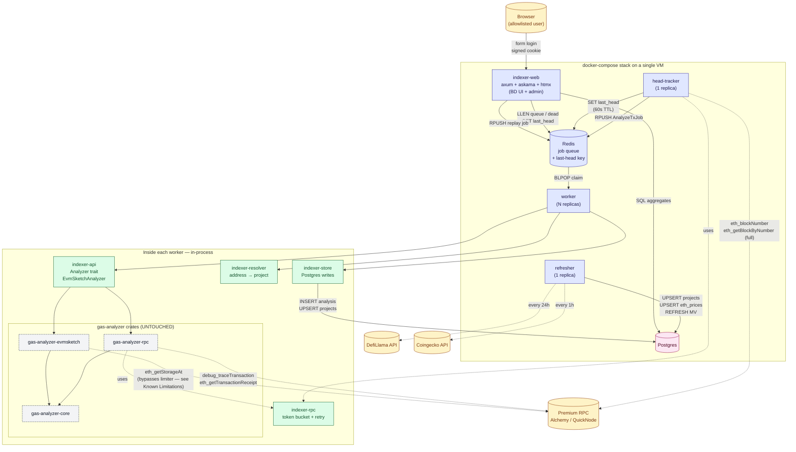

# Gas-Killer Indexer Service

A persistent service that consumes new Ethereum blocks, runs the existing gas-analyzer on every qualifying transaction, groups results by project, and exposes them through a purpose-built web UI (`indexer-web`) for BD outreach.

## Architecture



Solid arrows are data writes; dotted arrows are RPC / HTTP fetches. The thin green box is the modular API layer — it is the *only* code in the indexer that knows about gas-analyzer internals.

## Components

| Crate | Role |
|---|---|
| `indexer-api` | Thin modular API layer over gas-analyzer. `Analyzer` trait + `EvmSketchAnalyzer` impl. Exposes `analyze_tx(tx_hash) -> AnalysisReport`. **The only code that depends on `gas-analyzer-rpc` / `gas-analyzer-evmsketch`.** |
| `indexer-rpc` | Global token-bucket rate limiter (`governor`) + bounded-concurrency semaphore + jittered exponential-backoff retry helper. Per-method weight constants in `weights` module. |
| `indexer-store` | Postgres schema + sqlx migrations + insert/refresh helpers. Owns the `analysis` fact table, `projects` / `address_project` / `eth_prices` dimensions, and the `project_daily` materialized view. |
| `indexer-resolver` | Address → project mapping. DefiLlama HTTP client + curated YAML overlay. Snapshot held behind `arc-swap` for lock-free reads. Unmapped addresses fall back to `unknown:0xADDR` so no row is ever dropped. |
| `indexer-service` | Single binary (lib + bin), three clap subcommands: `head-tracker`, `worker`, `refresher`. The library surface re-exports `queue` and `state` for use by `indexer-web`. |
| `indexer-web` | Axum + Askama + htmx web UI. Reads aggregates from Postgres, reads queue/last-head counters from Redis, and RPUSH-es replay jobs back to the same Redis queue. Auth is a static YAML allowlist + HMAC-signed session cookie. |

The six new crates are added to the workspace's `members` and `default-members`. **No edits were made to `crates/{core,gas-estimator,rpc,evmsketch,anvil,cli,wasm}`.**

## Service roles

### `head-tracker` (1 replica)

Polls the chain head every `HEAD_POLL_MS` (default 4s). For each new block:
1. Fetches the block with full transactions (`eth_getBlockByNumber(n, true)`).
2. For each tx that calls a contract (skip create txs at this layer), pushes one `AnalyzeTxJob` onto Redis list `analyzer:queue:pending`.
3. **Backpressure**: if `LLEN(pending) > MAX_QUEUE_DEPTH`, pauses enqueueing until the queue drains. We never drop blocks — we just lag.

Live-only: starts at the current head and never looks backward. Reorgs are ignored (accepted ~1% inaccuracy at head).

### `worker` (N replicas)

Each worker:
1. `BLPOP`s a job from the queue.
2. Acquires `weights::ANALYZE_TX` (250) tokens from its local `RateLimiter`.
3. Calls `analyzer.analyze_tx(tx_hash)` (the lifted CLI orchestration: receipt → trace → preceding txs → measured estimate via EvmSketch, with heuristic fallback).
4. Resolves `report.to` to a project via the resolver.
5. Inserts the row into `analysis`, upserts the project, upserts the address-to-project mapping.
6. On `Skipped(reason)` (contract create / below threshold / reverted), drops silently.
7. On other errors, retries up to `WORKER_MAX_RETRIES` then dead-letters to `analyzer:queue:dead`.

### `refresher` (1 replica)

Three independent loops:
- Every 24h (`RESOLVER_REFRESH_SECS`): reload `overlay.yaml`, fetch DefiLlama protocol catalog, atomically swap the resolver snapshot, upsert all projects into Postgres.
- Every 1h (`PRICE_REFRESH_SECS`): fetch ETH/USD from Coingecko, upsert into `eth_prices` keyed by today's UTC date.
- Every 1h (`ROLLUP_REFRESH_SECS`): `REFRESH MATERIALIZED VIEW CONCURRENTLY project_daily`.

### `indexer-web` (1 replica)

Axum HTTP server on port 3000. Pages:

| Path | Auth | Purpose |
|---|---|---|
| `/login` | public | Username/password form. Verifies against `users.yaml`. Issues an HMAC-signed cookie on success. |
| `/` | required | Overview: top-line USD-saved totals (lifetime / 30d / 7d / 24h), project leaderboard, daily-savings line chart, category bar chart. |
| `/projects/:slug` | required | Drill-down: per-project totals, daily series (90d), top contracts, top function selectors, recent transactions table. |
| `/unknowns` | required | Top unlabeled `to_address` rows by ETH saved last 30d. Includes a copy-paste-ready overlay snippet. |
| `/admin` | required | Service health (read-only) + on-demand tx replay form. |
| `/admin/health` | required | htmx partial used by the admin page to refresh health counters every 5s. |
| `/healthz` | public | Plain `ok` response for compose healthchecks. |

**Auth.** Users are listed in a YAML allowlist mounted at `/etc/indexer/users.yaml`:
```yaml
- username: ramgos
  bcrypt_hash: "$2b$12$..."
```
Sessions are stateless — the cookie is `username|expires|HMAC-SHA256(secret, "username|expires")`, base64url-encoded. The HMAC key comes from `SESSION_SECRET` (≥32 bytes; generate with `openssl rand -hex 32`). 7-day TTL, `SameSite=Strict`, `HttpOnly`.

**Admin functions.**
- *Service health* — every 5s the admin page refreshes counters: latest analyzed block, head-tracker last seen block (read from Redis key `indexer:state:last_head`, set with 60s TTL by the head-tracker), blocks-behind, pending queue depth (`LLEN analyzer:queue:pending`), dead-letter depth (`LLEN analyzer:queue:dead`), heuristic rate over last 1h / 24h, last-insert age, total rows.
- *On-demand tx replay* — paste a 32-byte tx hash → web RPUSH-es an `AnalyzeTxJob` directly to the queue, bypassing the head-tracker's `MIN_GAS_USED` filter. The next available worker picks it up; refresh the page after ~10s and the analysis row should be present.

## Database schema

Defined in `crates/indexer-store/migrations/20260101000001_init.sql`.

- `analysis` — fact table, one row per analyzed tx. Indexed by `(project_slug, block_timestamp DESC)` and `(chain_id, block_timestamp DESC)`.
- `projects` — slug → name, category, contact info.
- `address_project` — `(chain_id, address) → project_slug`. Hot lookup table for "which contracts belong to project X".
- `eth_prices` — `day → usd_per_eth`. Used for USD savings calculation.
- `project_daily` — materialized view: per-project per-day totals (tx count, gas saved, wei saved, **USD saved**, avg savings %, heuristic rate). This is what `indexer-web` reads for leaderboards and overview totals.

## BD metrics (what the dashboard surfaces)

- **Project leaderboard** — USD saved (lifetime / 30d / 7d / 1d) sorted desc. The BD call list.
- **Per-project drill-down** — top 10 contracts, top 10 function selectors, savings % distribution, daily trend.
- **Whales we haven't labeled** — top `unknown:0x...` rows by USD saved → guides what to add to `overlay.yaml`.
- **Service health** — heuristic rate, blocks behind head, queue depth.

## Configuration

All via env vars. See `.env.example` for the full list. Most important:

| Var | Purpose | Default |
|---|---|---|
| `RPC_URL` | Required. Premium provider endpoint. | — |
| `CHAIN_ID` | Stamps every analysis row. **One indexer instance per chain.** | `1` |
| `DATABASE_URL`, `REDIS_URL` | Standard. | — |
| `RPC_RPS_BUDGET` | Sustained tokens/sec. **Top priority.** Aim for ~30-40% of plan ceiling — conservative on purpose. | `100` |
| `RPC_BURST` | Short-spike allowance. | `25` |
| `RPC_MAX_CONCURRENCY` | Hard cap on simultaneous outbound calls. | `8` |
| `MIN_GAS_USED` | Skip txs below this. | `50000` |
| `MAX_QUEUE_DEPTH` | Backpressure threshold for head-tracker. | `1000` |
| `WORKER_MAX_RETRIES` | Per-job retry count before dead-letter. | `3` |
| `OVERLAY_PATH` | Curated address overlay YAML. | `/etc/indexer/overlay.yaml` |
| `DEFILLAMA_URL`, `PRICE_URL` | Empty disables the corresponding refresh. | (set) |
| `SESSION_SECRET` | Required for `indexer-web`. HMAC-SHA256 key, ≥32 bytes. | — |
| `EXPLORER_TX_URL`, `EXPLORER_ADDRESS_URL` | Block-explorer base URLs (trailing slash) used in tx / address links. | Etherscan |

## Deployment

```bash
# .env (minimum: POSTGRES_PASSWORD, RPC_URL, SESSION_SECRET).
cp .env.example .env
$EDITOR .env

# Allowlist: at least one user with a bcrypt password hash.
cp users.yaml.example users.yaml
htpasswd -bnBC 12 "" 'YOUR-PASSWORD' | tr -d ':\n'   # paste the hash into users.yaml

# Build the image once.
docker compose build indexer-build

# Start everything.
docker compose up -d

# Open the dashboard: http://<host>:3000 — sign in with the user you added.
```

**Multi-chain**: stand up a second compose stack with a different `CHAIN_ID`, separate Postgres database, and a different RPC endpoint. The service does not multiplex chains in one process by design.

## Adding a project to the curated overlay

Edit `crates/indexer-resolver/data/overlay.yaml`:

```yaml
- chain_id: 1
  address: "0x..."             # contract address (lowercase)
  project_slug: "uniswap-v3"
  project_name: "Uniswap V3"
  category: "dex"              # optional
  contact:                      # optional, used for BD outreach
    primary: "team@example.com"
    url: "https://discord.gg/..."
```

Rebuild + restart, or wait for the resolver's 24h refresh.

## Known v1 limitations

These are intentional trade-offs from the "minimal-touch wrapper" choice — the existing gas-analyzer crates were not modified. Each can be addressed later:

1. **EvmSketch internal RPC bypass.** `GasKillerEvmSketch::builder().build()` constructs its own internal `alloy` provider per `analyze_tx` call. Storage reads issued during simulation (`eth_getStorageAt`, `eth_getCode`) are not gated by our rate limiter. We compensate with a deliberately generous `weights::ANALYZE_TX = 250` charge that over-approximates the bypassed traffic. Closing this gap requires either (a) lifting the orchestration into `gas_analyzer_evmsketch` so it accepts a pre-built rate-limited provider, or (b) running an in-process HTTP proxy that sits in front of all RPC calls.

2. **No queue visibility timeout.** A worker that crashes mid-job loses that job. Acceptable because we ignore reorgs and per-block tx volume regenerates state quickly. To fix: track in-flight jobs in a Redis hash and have the head-tracker (or a sweeper) reclaim stale ones.

3. **No reorg handling.** ~1% of mainnet head rows may correspond to reorged blocks. Acceptable per project decision. To fix: lag the head by N confirmations, or analyze head + retract on reorg.

4. **DefiLlama address mapping deferred.** The resolver pulls protocol metadata from DefiLlama's `/protocols` endpoint but does *not* call `/protocol/{slug}` per protocol to extract per-chain contract addresses. Address-to-project resolution is overlay-only for now. To fix: add a per-protocol fetch step in the refresher with caching.

5. **Library errors still use `anyhow`.** The `feedback_thiserror_internal.md` memory says internal libraries should use `thiserror`. The new indexer crates do; the existing gas-analyzer crates still use `anyhow` because we agreed not to touch them. To fix: a separate refactor PR that migrates `gas-analyzer-{core,rpc,evmsketch,anvil,gas-estimator}` to typed errors.

6. **Per-worker rate limiter, not global.** With `worker.deploy.replicas: 4`, each worker has its own in-process token bucket. The configured `RPC_RPS_BUDGET` therefore applies *per worker*, not globally. Either set the budget to `total / N`, or move to a Redis-backed shared limiter.

## Verification

```bash
# Unit tests (in-process, no external deps).
cargo test -p indexer-api -p indexer-rpc -p indexer-store -p indexer-resolver --lib

# Type-check the whole workspace.
cargo check --workspace

# Smoke test (live, requires .env with real RPC).
docker compose up -d
docker compose logs -f head-tracker worker
# Expect: "block fanned out" lines from head-tracker and "persisted" lines from workers
# within ~30s of startup. Check `analysis` row count grows.
psql $DATABASE_URL -c "SELECT count(*) FROM analysis;"
```
